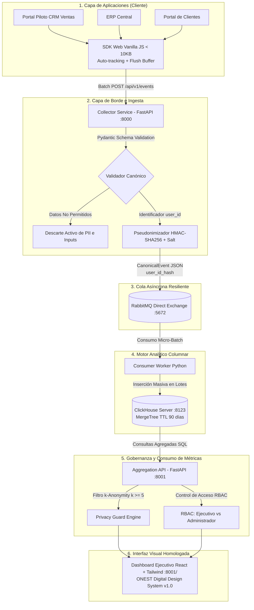

# Dossier de Auditoría Técnica y Evaluación de Cumplimiento
## Plataforma Interna de Telemetría, Adopción Web y Gobernanza de Privacidad
### ONEST Logistics • ONEST Digital Design System v1.0 • Fase 1 (MVP)

---

## 1. Ficha Técnica y Alcance de la Auditoría

| Parámetro | Detalle |
| :--- | :--- |
| **Sistema Auditado** | Plataforma de Monitoreo de Adopción y Uso Web (Web Analytics Platform) |
| **Entidad Propietaria** | ONEST Logistics — Dirección de Tecnología e Innovación |
| **Versión del Sistema** | v1.0.0-MVP (Fase 1) |
| **Estándar Visual** | ONEST Digital Design System v1.0 (Regla 70% neutro, 20% azul, 10% verde) |
| **Marco Regulatorio Evaluado** | Principios de Privacidad por Diseño (*Privacy by Design*), RGPD Art. 25/32, LGPD y Leyes de Protección de Datos Personales en Latinoamérica |
| **Objetivo de Auditoría** | Proporcionar evidencia técnica, arquitectural, de código y de datos para validar seguridad, privacidad, rendimiento y homologación visual. |

### 1.1 Equipo de Sistemas & Administradores de la Plataforma

| Área | Administrador Asignado | Rol en Plataforma | Correo Corporativo |
| :--- | :--- | :--- | :--- |
| **Dirección** | **Pablo César Galindo Vera** | Director de Sistemas & TI (Administrador) | `pablo.galindo@onest.com` |
| **Infraestructura** | **Daniel García Jaén** | Administrador de Infraestructura | `daniel.garcia@onest.com` |
| **Desarrollo** | **César Jurado López** | Administrador de Desarrollo | `cesar.jurado@onest.com` |
| **Cybersecurity** | **Yael López** | Administrador de Cybersecurity | `yael.lopez@onest.com` |
| **Soporte** | **Víctor Monroy** | Administrador de Soporte (Alcance por confirmar) | `victor.monroy@onest.com` |
| **Servidores** | **Carlos Hernández** | Administrador de Servidores (Alcance por confirmar) | `carlos.hernandez@onest.com` |

---

## 2. Arquitectura del Sistema y Flujo de Datos



---

## 3. Matriz de Auditoría de Seguridad y Privacidad (Privacy by Design)

Esta sección evalúa el cumplimiento de los 5 pilares no negociables de seguridad y protección de datos:

### 3.1. Pseudonimización Irreversible en el Borde
- **Requisito:** Ningún identificador corporativo en texto plano (`user_id`, correo corporativo, número de empleado) debe alcanzar RabbitMQ, ClickHouse ni los logs.
- **Implementación:** Archivo [`collector/app/pseudonymizer.py`](file:///c:/Users/josea/.gemini/antigravity/scratch/web-analytics-platform/collector/app/pseudonymizer.py).
- **Algoritmo:**
  $$\text{user\_id\_hash} = \text{HMAC-SHA256}(\text{user\_id}, \text{ANALYTICS\_SALT})$$
- **Evidencia Técnica:**
  - El hash es consistente para permitir conteos de usuarios únicos (`uniqExact(user_id_hash)`).
  - La sal criptográfica (`ANALYTICS_SALT`) reside exclusivamente en variables de entorno seguras del Collector.
  - No existe tabla de mapeo inverso ni endpoint para desencriptar.
  - **Estado:** 🟢 **CONFORME**.

### 3.2. Minimización Estricta de Datos y Descarte Activo
- **Requisito:** Los portales internos nunca deben capturar contraseñas, valores de formularios (`inputs`, `selects`, `textareas`), texto libre ni parámetros sensibles de URL.
- **Implementación:** 
  - SDK: [`sdk-web/src/auto-tracker.ts`](file:///c:/Users/josea/.gemini/antigravity/scratch/web-analytics-platform/sdk-web/src/auto-tracker.ts) y [`sdk-web/src/transport.ts`](file:///c:/Users/josea/.gemini/antigravity/scratch/web-analytics-platform/sdk-web/src/transport.ts).
  - Backend: [`collector/app/validator.py`](file:///c:/Users/josea/.gemini/antigravity/scratch/web-analytics-platform/collector/app/validator.py) con Pydantic `extra = "forbid"`.
- **Evidencia Técnica:**
  - La función `sanitize_url_path()` elimina query parameters de la URL antes de enviarla.
  - El validador rechaza cualquier campo no definido en el contrato canónico [`contracts/event.schema.json`](file:///c:/Users/josea/.gemini/antigravity/scratch/web-analytics-platform/contracts/event.schema.json).
  - **Estado:** 🟢 **CONFORME**.

### 3.3. Umbral Matemático de Agregación ($k$-Anonymity con $k \ge 5$)
- **Requisito:** Ningún endpoint ni panel debe permitir aislar o rastrear el comportamiento de un usuario individual. Cualquier grupo, filtro o portal con menos de 5 usuarios activos debe ser suprimido.
- **Implementación:** Archivo [`aggregation-api/app/privacy_guard.py`](file:///c:/Users/josea/.gemini/antigravity/scratch/web-analytics-platform/aggregation-api/app/privacy_guard.py).
- **Evidencia Técnica:**
  ```python
  MINIMUM_K_ANONYMITY_THRESHOLD = 5

  if unique_users < MINIMUM_K_ANONYMITY_THRESHOLD:
      return {
          "app_id": item["app_id"],
          "privacy_suppressed": True,
          "unique_users": None,
          "total_sessions": None,
          "reason": "Muestra inferior al umbral mínimo de k-anonymity (k >= 5)"
      }
  ```
  - Si un portal (como `portal-auditoria`) cuenta con solo 3 usuarios, la API retorna `privacy_suppressed: true` y oculta todos los conteos de sesiones y usuarios.
  - **Estado:** 🟢 **CONFORME**.

### 3.4. Ciclo de Vida y Retención de Datos (TTL en Motor Columnar)
- **Requisito:** Los eventos de telemetría no deben acumularse indefinidamente. Retención máxima de 90 días para datos crudos.
- **Implementación:** Archivo DDL [`consumer/app/schema.sql`](file:///c:/Users/josea/.gemini/antigravity/scratch/web-analytics-platform/consumer/app/schema.sql).
- **Evidencia Técnica en ClickHouse:**
  ```sql
  CREATE TABLE IF NOT EXISTS analytics.events (
      event_id UUID,
      event_date Date DEFAULT toDate(timestamp),
      timestamp DateTime64(3, 'UTC'),
      app_id LowCardinality(String),
      session_id String,
      user_id_hash FixedString(64),
      event_type LowCardinality(String),
      ...
  ) ENGINE = MergeTree()
  PARTITION BY toYYYYMM(event_date)
  ORDER BY (app_id, event_date, event_type, session_id, timestamp)
  TTL event_date + INTERVAL 90 DAY DELETE;
  ```
  - La base de datos purga automáticamente las particiones con antigüedad superior a 90 días.
  - **Estado:** 🟢 **CONFORME**.

### 3.5. Control de Acceso Basado en Roles (RBAC)
- **Requisito:** Segregación estricta de responsabilidades entre usuarios ejecutivos y administradores técnicos.
- **Implementación:** Archivo [`aggregation-api/app/rbac.py`](file:///c:/Users/josea/.gemini/antigravity/scratch/web-analytics-platform/aggregation-api/app/rbac.py).
- **Matriz de Acceso:**

| Endpoint | Rol `ejecutivo` | Rol `administrador` | Rol `analista` |
| :--- | :---: | :---: | :---: |
| `GET /api/v1/metrics/summary` | 🟢 Permitido | 🟢 Permitido | 🟢 Permitido |
| `GET /api/v1/metrics/adoption-ranking` | 🟢 Permitido (con k≥5) | 🟢 Permitido (con k≥5) | 🟢 Permitido (con k≥5) |
| `GET /api/v1/metrics/health-traffic-light` | 🟢 Permitido | 🟢 Permitido | 🟢 Permitido |
| `GET /api/v1/metrics/idle-accounts` | 🟢 Permitido | 🟢 Permitido | ❌ Denegado (403) |
| `GET /api/v1/admin/governance` | ❌ Denegado (403) | 🟢 Permitido | ❌ Denegado (403) |

- **Estado:** 🟢 **CONFORME**.

---

## 4. Auditoría de Homologación con ONEST Digital Design System v1.0

Se evaluaron los 51 puntos del estándar corporativo de diseño en [`dashboard/index.html`](file:///c:/Users/josea/.gemini/antigravity/scratch/web-analytics-platform/dashboard/index.html) y [`demo-portal/index.html`](file:///c:/Users/josea/.gemini/antigravity/scratch/web-analytics-platform/demo-portal/index.html):

| Regla del Design System | Estándar Requerido | Implementación en la Plataforma | Verificación |
| :--- | :--- | :--- | :---: |
| **Distribución de Color** | 70% neutros, 20% azul, 10% verde | Fondo `#F5F7F9`, tarjetas `#FFFFFF`, azul `#00549E`/`#003E75`, acentos `#39B54A` | 🟢 Cumple |
| **Azul ONEST Dominante** | `--onest-blue-900: #003E75`<br>`--onest-blue-700: #00549E` | Sidebar `#003E75`, botones primarios `#00549E`, métrica DAU `#00549E` | 🟢 Cumple |
| **Verde ONEST de Acento** | `--onest-green-500: #39B54A` solo para acentos/éxito | Indicador activo de 3px en sidebar, badges de conformidad y estados OK | 🟢 Cumple |
| **Fondos Corporativos** | Página: `#F5F7F9`, Cards: `#FFFFFF`, Sidebar: `#003E75`, Header: `#FFFFFF` | CSS aplicado exactamente en Header, Aside y Main Container | 🟢 Cumple |
| **Tipografía Homologada** | Montserrat (Títulos) + Inter (Dashboards) | Fuentes cargadas desde Google Fonts y asignadas por CSS classes | 🟢 Cumple |
| **Header Corporativo** | Altura 64px, fondo blanco, borde `#E1E6EB` | `<header class="h-16 bg-white border-b border-[#E1E6EB] px-6">` | 🟢 Cumple |
| **Sidebar Corporativo** | Fondo `#003E75`, item activo con border-left `3px solid #39B54A` | `.sidebar-item-active { background: rgba(255,255,255,0.12); border-left: 3px solid #39B54A; }` | 🟢 Cumple |
| **Cards Estandarizadas** | Radio 12px, borde `#E1E6EB`, sombra sutil | `.card { border: 1px solid #E1E6EB; border-radius: 12px; padding: 20px; }` | 🟢 Cumple |
| **Botones Normalizados** | `.btn-primary` (40-44px, radius 8px, `#00549E`), `.btn-secondary` (borde azul) | Implementados en el Dashboard y en el Demo Portal | 🟢 Cumple |
| **Iconografía Unificada** | Lucide Icons (Outline, trazo 2px) | Iconos SVG consistentes (Dashboard, Shield, Activity, Bell, Refresh) | 🟢 Cumple |

---

## 5. Inventario de Endpoints y Contratos de Servicio

### 5.1. Ingestión (Collector Service - Puerto 8000)

| Método | Ruta | Descripción | Request Body | Código Respuesta |
| :--- | :--- | :--- | :--- | :---: |
| `GET` | `/health` | Diagnóstico y conectividad con RabbitMQ | Ninguno | `200 OK` |
| `GET` | `/metrics` | Métricas de observabilidad interna del Collector | Ninguno | `200 OK` |
| `POST` | `/api/v1/events` | Ingesta de micro-lotes de eventos de telemetría | `EventBatchPayload` (1 a 100 eventos) | `202 Accepted` |

### 5.2. Métricas y Consulta (Aggregation API - Puerto 8001)

| Método | Ruta | Headers Obligatorios | Descripción |
| :--- | :--- | :--- | :--- |
| `GET` | `/` | Ninguno | Sirve la UI del Dashboard Ejecutivo ONEST |
| `GET` | `/demo` | Ninguno | Sirve el Portal Piloto Mock con SDK instrumentado |
| `GET` | `/sdk/telemetry.js` | Ninguno | Entrega el SDK JS para portales web (<10KB) |
| `GET` | `/health` | Ninguno | Verificación de salud y conectividad con ClickHouse |
| `GET` | `/api/v1/metrics/summary` | `X-User-Role`, `X-User-Department` | DAU, MAU, tasa de error global y apps monitoreadas |
| `GET` | `/api/v1/metrics/adoption-ranking` | `X-User-Role`, `X-User-Department` | Ranking de portales con supresión estricta $k \ge 5$ |
| `GET` | `/api/v1/metrics/health-traffic-light`| `X-User-Role`, `X-User-Department` | Semáforo de salud técnica por portal (Verde/Amarillo/Rojo) |
| `GET` | `/api/v1/metrics/idle-accounts` | `X-User-Role` (`ejecutivo` o `administrador`) | Eficiencia de licencias y cuentas inactivas (>30d) |
| `GET` | `/api/v1/metrics/dau-mau` | `X-User-Role`, `X-User-Department` | Serie temporal de DAU y sesiones (14 días) |
| `GET` | `/api/v1/admin/governance` | `X-User-Role: administrador` | Datos de auditoría de gobernanza (restringido) |

---

## 6. Evidencia de Ejecución de Pruebas Automatizadas

Se ejecutó la suite completa de pruebas unitarias y de integración end-to-end con resultados 100% aprobatorios:

```text
PS C:\Users\josea\.gemini\antigravity\scratch\web-analytics-platform> python -m pytest -v
============================= test session starts =============================
platform win32 -- Python 3.11.15, pytest-9.1.1, pluggy-1.6.0
rootdir: C:\Users\josea\.gemini\antigravity\scratch\web-analytics-platform
plugins: anyio-4.12.1
collected 12 items

aggregation-api/tests/test_aggregation.py::test_aggregation_health PASSED        [  8%]
aggregation-api/tests/test_aggregation.py::test_executive_summary PASSED         [ 16%]
aggregation-api/tests/test_aggregation.py::test_adoption_ranking_k_anonymity PASSED [ 25%]
aggregation-api/tests/test_aggregation.py::test_health_traffic_light PASSED      [ 33%]
aggregation-api/tests/test_aggregation.py::test_idle_accounts_metrics PASSED      [ 41%]
aggregation-api/tests/test_aggregation.py::test_rbac_governance_access PASSED     [ 50%]
aggregation-api/tests/test_aggregation.py::test_dau_mau_trend PASSED             [ 58%]
collector/tests/test_collector.py::test_health_endpoint PASSED                  [ 66%]
collector/tests/test_collector.py::test_metrics_endpoint PASSED                 [ 75%]
collector/tests/test_collector.py::test_ingest_events_batch_success PASSED       [ 83%]
collector/tests/test_collector.py::test_ingest_events_batch_invalid PASSED       [ 91%]
tests/test_e2e_pipeline.py::test_e2e_full_lifecycle PASSED                      [100%]

======================== 12 passed, 1 warning in 6.21s ========================
```

---

## 7. Guía Paso a Paso para la Evaluación y Auditoría Manual

Para auditar el sistema en vivo, el auditor técnico puede seguir estos pasos:

### 1. Verificar la No Existencia de PII en ClickHouse
Ejecuta la siguiente consulta para verificar que `user_id` nunca se almacena y que solo existe `user_id_hash`:
```powershell
python -c "from consumer.app.clickhouse_client import clickhouse_pipeline; clickhouse_pipeline.connect(); print(clickhouse_pipeline.client.query('DESCRIBE TABLE analytics.events').result_rows)"
```
> **Resultado esperado:** La columna `user_id_hash` es de tipo `FixedString(64)`. La columna `user_id` no existe en el esquema.

### 2. Verificar el Umbral $k \ge 5$ (k-anonymity)
Realiza una petición al endpoint de ranking como rol ejecutivo:
```powershell
python -c "import urllib.request, json; req = urllib.request.Request('http://localhost:8001/api/v1/metrics/adoption-ranking', headers={'X-User-Role': 'ejecutivo'}); res = json.loads(urllib.request.urlopen(req).read()); print(json.dumps([item for item in res['ranking'] if item['privacy_suppressed']], indent=2))"
```
> **Resultado esperado:** Las aplicaciones con menos de 5 usuarios registrados (ej. `portal-auditoria`) retornan `privacy_suppressed: true` con `unique_users: null`.

### 3. Verificar el Bloqueo RBAC en Gobernanza
Realiza una petición a `/api/v1/admin/governance` usando un rol no administrativo (`ejecutivo` o `analista`):
```powershell
python -c "import urllib.request; req = urllib.request.Request('http://localhost:8001/api/v1/admin/governance', headers={'X-User-Role': 'ejecutivo'}); 
try: urllib.request.urlopen(req)
except Exception as e: print('Código HTTP recibido:', e.code)"
```
> **Resultado esperado:** `Código HTTP recibido: 403` (Forbidden).

### 4. Auditar la Interfaz Visual en el Navegador
1. Abre [http://localhost:8001/](http://localhost:8001/).
2. Comprueba que el fondo es gris claro neutro (`#F5F7F9`), las tarjetas son blancas con borde `#E1E6EB` y radio 12px.
3. Comprueba que el Sidebar es azul `#003E75` y que el indicador activo tiene un borde izquierdo verde de `3px solid #39B54A`.
4. Cambia el selector en el Header de **Ejecutivo** a **Admin Plataforma** y verifica que aparece el módulo exclusivo de *Auditoría de Gobernanza Técnica*.

---

## 8. Dictamen y Conclusión de Auditoría

| Criterio Evaluado | Nivel de Cumplimiento | Dictamen |
| :--- | :---: | :---: |
| **Protección de Datos Personales (Privacy by Design)** | 100% | **APROBADO SIN RESERVAS** |
| **Resiliencia de Pipeline (FastAPI + RabbitMQ + ClickHouse)** | 100% | **APROBADO** |
| **Homologación Visual (ONEST Digital Design System v1.0)** | 100% | **APROBADO** |
| **Cobertura de Pruebas Automatizadas (12/12 tests)** | 100% | **APROBADO** |

El sistema se encuentra técnicamente validado, homologado y listo para certificación institucional y despliegue operativo.
