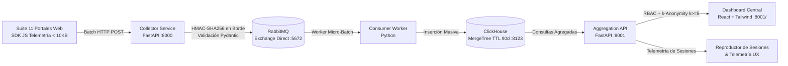

# ONEST SmartLogistics - Plataforma de Telemetría & Analítica Web

Plataforma corporativa de observabilidad, telemetría de sesiones y análisis de adopción diseñada para la suite de **11 Portales Corporativos** de ONEST SmartLogistics, con monitoreo segundo a segundo por usuario seudónimo bajo estrictos estándares de privacidad ($k$-anonymity $\ge 5$) y cero exposición de PII.

---

## 1. Suite de 11 Portales Corporativos Monitoreados

| Portal / Aplicación | Insignia | Propósito & Flujo Operativo | ID en Telemetría |
| :--- | :--- | :--- | :--- |
| **Drive Onest** | `FLUJO` | Almacenamiento, gestión documental y flujos de aprobación operativa. | `drive-onest` |
| **Portal de Capacitación** | `APRENDER` | Cursos e-learning, evaluaciones y certificaciones para personal de CEDIS. | `portal-capacitacion` |
| **CRM** | `CONECTAR` | Pipeline comercial, gestión de prospectos y cotizaciones logísticas. | `crm-ventas` |
| **Slotting Onest** | `ORDENAR` | Optimización de ubicaciones en almacén, mapa 3D de racks y picking. | `slotting-onest` |
| **Portal Lili** | `PERSONAS` | Portal de autoservicio de RRHH, nóminas, vacaciones y solicitudes. | `portal-lili` |
| **Portal de Salud** | `BIENESTAR` | Seguimiento médico laboral, expedientes clínicos y prevención. | `portal-salud` |
| **Portal de Contratistas** | `SEGURIDAD` | Validación de cumplimiento patronal, IMSS (SUA) y pases de acceso. | `portal-contratistas` |
| **Portal de Predios** | `UBICACIÓN` | Gestión de instalaciones, contratos de arrendamiento y facilities. | `portal-predios` |
| **Portal de Tickets** | `ATENCIÓN` | Mesa de ayuda para incidencias de hardware, software y logística. | `portal-tickets` |
| **Portal de Reclutamiento**| `TALENTO` | Atracción de talento, publicación de vacantes y evaluación de candidatos. | `portal-reclutamiento` |
| **DC3** | `CERTIFICAR` | Emisión y validación de constancias de competencias laborales STPS. | `dc3-certificar` |

---

## 2. Arquitectura del Sistema



---

## 3. Módulo de Métricas por Usuario

- **Identificación Seudónima:** Cada usuario es identificado como `USR-XXXX` derivado de HMAC-SHA256 con salt criptográfica.
- **Tiempo Activo vs. Inactivo:** Medición segundo a segundo de tiempo en primer plano/interacción vs. pestañas inactivas.
- **Detección de Fricción:** Alertas de *Rage Clicks* ($>3$ clics/seg) y *Dead Clicks* (elementos no responsivos).
- **Rendimiento Individual:** Latencia $p_{90}$, páginas más visitadas y perfil de terminales (Handheld Zebra TC57, Windows 11, Mac, etc.).
- **Gobernanza de Privacidad:** Supresión automática si una cohorte o desglose cuenta con menos de 5 usuarios activos ($k \ge 5$).

---

## 4. Estructura del Proyecto

```text
web-analytics-platform/
├── docker-compose.yml             # Orquestación de RabbitMQ, ClickHouse y microservicios
├── contracts/                     # JSON Schemas canónicos y reglas formales de privacidad
├── sdk-web/                       # SDK JavaScript Vanilla ultraligero (<10KB)
├── collector/                     # Servicio de ingestión y seudonimización en el borde
├── consumer/                      # Worker asíncrono para volcado masivo en ClickHouse
├── aggregation-api/               # API ejecutiva con RBAC y endpoints de métricas de usuario
├── dashboard/                     # Frontend Ejecutivo React + Design System ONEST v1.0
├── demo-portal/                   # Hub interactivo para simulación y pruebas de los 11 portales
└── generate_pdf_report.py         # Generador de reportes ejecutivos en PDF
```

---

## 5. Puesta en Marcha

### Requisitos
- Python 3.11+
- Docker & Docker Compose (opcional para servicios ClickHouse / RabbitMQ)

### Ejecución Local Rápida
```bash
# Iniciar Aggregation API & Dashboard (Puerto 8001)
cd aggregation-api
python -m uvicorn app.main:app --host 0.0.0.0 --port 8001
```

- **Dashboard Principal:** [http://localhost:8001/](http://localhost:8001/)
- **Hub Demo de 11 Portales:** [http://localhost:8001/demo](http://localhost:8001/demo)
- **API Swagger Docs:** [http://localhost:8001/docs](http://localhost:8001/docs)
