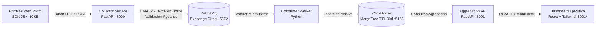

# Plataforma Interna de Monitoreo de Adopción y Uso Web (Fase 1 - MVP)

Plataforma self-hosted y on-premise diseñada para monitorear el uso, adopción y salud técnica de 20+ portales web corporativos (>5,000 usuarios activos), proporcionando visibilidad ejecutiva bajo estrictos principios de minimización de datos y privacidad en Latinoamérica.

---

## 1. Arquitectura de Componentes



---

## 2. Privacidad y Seguridad por Diseño (No Negociable)

1. **Pseudonimización en el Borde:** El identificador corporativo del usuario (`user_id`) es convertido en el Collector a `user_id_hash = HMAC_SHA256(user_id, ANALYTICS_SALT)`. El valor real en texto plano **nunca** se almacena en ClickHouse ni se publica a RabbitMQ. El mapeo inverso no existe.
2. **Minimización de Datos:** El SDK y el Collector descartan activamente contraseñas, valores de formularios, campos de texto libre y limpian parámetros sensibles de URL (`?token=...`, `?email=...`).
3. **Umbral Mínimo de Agregación ($k \ge 5$):** Ningún dashboard ni endpoint expone datos individuales. Cualquier desglose con menos de 5 usuarios únicos activos es automáticamente suprimido (`privacy_suppressed: true`).
4. **Retención de Datos:** Tabla ClickHouse configurada con particionado mensual y política `TTL event_date + INTERVAL 90 DAY`.

---

## 3. Estructura del Repositorio

```text
web-analytics-platform/
├── docker-compose.yml             # Orquestación de RabbitMQ, ClickHouse y microservicios
├── contracts/
│   ├── event.schema.json          # JSON Schema estricto del evento canónico v1
│   └── privacy_rules.md           # Definición formal de datos permitidos y prohibidos
├── sdk-web/
│   ├── src/                       # TypeScript fuente (index, auto-tracker, transport)
│   └── dist/telemetry.js          # Distribución autónoma Vanilla JS (<10KB)
├── collector/
│   ├── app/                       # FastAPI Ingestion & HMAC-SHA256 Pseudonymization
│   └── tests/                     # Pruebas unitarias de validación y sanitización
├── consumer/
│   ├── app/                       # Worker RabbitMQ -> ClickHouse
│   └── app/schema.sql             # DDL ClickHouse (MergeTree con particiones y TTL)
├── aggregation-api/
│   ├── app/                       # API con RBAC (ejecutivo vs administrador) y k-anonymity
│   └── tests/                     # Pruebas unitarias de autorización y supresión k>=5
├── dashboard/
│   └── index.html                 # Frontend Ejecutivo React + Tailwind (servido en :8001/)
├── demo-portal/
│   └── index.html                 # Portal web mock instrumentado para pruebas en vivo
└── tests/
    └── test_e2e_pipeline.py       # Prueba de integración y ciclo de vida de extremo a extremo
```

---

## 4. Puesta en Marcha Rápida (On-Premise)

### Requisitos
- Docker & Docker Compose
- Python 3.11+ (para desarrollo o ejecución de tests)

### Iniciar Infraestructura
```bash
docker compose up -d rabbitmq clickhouse
```
- **RabbitMQ:** Puerto AMQP `5672`, Panel Web de Gestión: `http://localhost:15672` (usuario: `guest`, clave: `guest`).
- **ClickHouse:** Puerto HTTP `8123`, Puerto Nativo: `9009`.

### Iniciar Collector y Aggregation API (Local o Contenedor)
```bash
# 1. Collector Service (Puerto 8000)
uvicorn collector.app.main:app --host 0.0.0.0 --port 8000

# 2. Aggregation API & Dashboard (Puerto 8001)
uvicorn aggregation_api.app.main:app --host 0.0.0.0 --port 8001
```

Acceder al Dashboard Ejecutivo:
👉 `http://localhost:8001/`

---

## 5. Integración del SDK en Portales Web

Agregar el script en el `<head>` o antes del cierre de `</body>`:

```html
<script src="http://localhost:8001/sdk/telemetry.js"></script>
<script>
  // 1. Inicialización automática
  Telemetry.init({
    appId: 'crm-ventas',
    endpoint: 'http://localhost:8000',
    flushIntervalMs: 5000,
    batchSize: 10
  });

  // 2. Vinculación con sesión corporativa (SSO)
  Telemetry.identify('usuario.corporativo@empresa.com', 'ejecutivo', 'ventas');
</script>
```

El SDK captura de forma transparente:
- `session_start` y `session_end` (gestión de inactividad de 30 min).
- `page_view` en navegación tradicional y SPAs (`pushState`, `replaceState`, `popstate`).
- `error` ante excepciones no capturadas de JS o promesas rechazadas.
- Tiempos de carga de página en milisegundos (`PerformanceNavigationTiming`).

---

## 6. Ejecución de la Suite de Pruebas

```bash
# Pruebas del Collector (Validación, Sanitización, Hashing)
python -m pytest collector/tests/test_collector.py -v

# Pruebas de la Aggregation API (RBAC y Umbral k >= 5)
python -m pytest aggregation-api/tests/test_aggregation.py -v

# Prueba Integral E2E (Pipeline completo con ClickHouse)
python tests/test_e2e_pipeline.py
```
